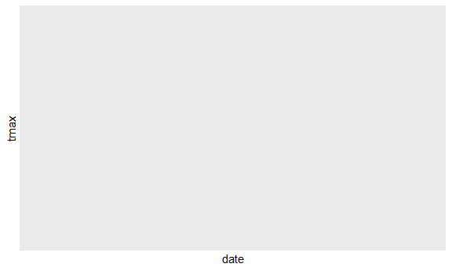
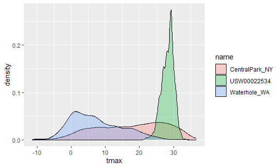
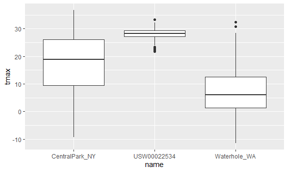
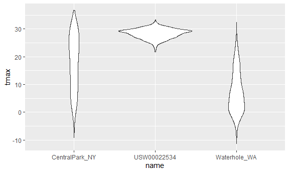
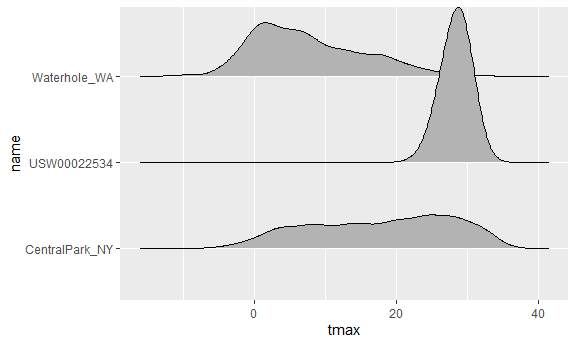
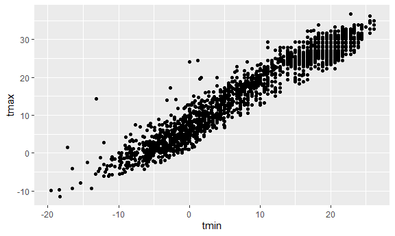

Viz Part 1
================
Zilin Huang
2023-10-03

``` r
library(ggridges)
library(tidyverse)
```

    ## ── Attaching core tidyverse packages ──────────────────────── tidyverse 2.0.0 ──
    ## ✔ dplyr     1.1.3     ✔ readr     2.1.4
    ## ✔ forcats   1.0.0     ✔ stringr   1.5.0
    ## ✔ ggplot2   3.4.3     ✔ tibble    3.2.1
    ## ✔ lubridate 1.9.2     ✔ tidyr     1.3.0
    ## ✔ purrr     1.0.2     
    ## ── Conflicts ────────────────────────────────────────── tidyverse_conflicts() ──
    ## ✖ dplyr::filter() masks stats::filter()
    ## ✖ dplyr::lag()    masks stats::lag()
    ## ℹ Use the conflicted package (<http://conflicted.r-lib.org/>) to force all conflicts to become errors

``` r
library(patchwork)

knitr::opts_chunk$set(
  fig.width = 6,
  fig.asp = .6,
  out.width = "90%"
)
```

``` r
weather_df = 
  rnoaa::meteo_pull_monitors(
    c("USW00094728", "USW00022534", "USS0023B17S"),
    var = c("PRCP", "TMIN", "TMAX"), 
    date_min = "2021-01-01",
    date_max = "2023-12-31") |>
  mutate(
    name = recode(
      id, 
      USW00094728 = "CentralPark_NY", 
      USW00022534 = "Molokai_HI",
      USS0023B17S = "Waterhole_WA"),
    tmin = tmin / 10,
    tmax = tmax / 10) |>
  select(name, id, everything())
```

    ## using cached file: C:\Users\huang\AppData\Local/R/cache/R/rnoaa/noaa_ghcnd/USW00094728.dly

    ## date created (size, mb): 2023-09-28 10:20:36.026108 (8.541)

    ## file min/max dates: 1869-01-01 / 2023-09-30

    ## using cached file: C:\Users\huang\AppData\Local/R/cache/R/rnoaa/noaa_ghcnd/USW00022534.dly

    ## date created (size, mb): 2023-09-28 10:21:35.507133 (3.838)

    ## file min/max dates: 1949-10-01 / 2023-09-30

    ## using cached file: C:\Users\huang\AppData\Local/R/cache/R/rnoaa/noaa_ghcnd/USS0023B17S.dly

    ## date created (size, mb): 2023-09-28 10:20:55.484716 (0.996)

    ## file min/max dates: 1999-09-01 / 2023-09-30

``` r
weather_df |>
  filter(name=="Molokai_HI")|>
  ggplot(aes(x=date,y=tmax))+
  geom_line()+
  geom_point()
```

    ## Warning: Removed 5 rows containing missing values (`geom_line()`).

    ## Warning: Removed 6 rows containing missing values (`geom_point()`).



Density plot.

``` r
ggplot(weather_df,aes(x=tmax,fill=name))+
  geom_density(alpha=0.3,adjust=.75)
```

    ## Warning: Removed 33 rows containing non-finite values (`stat_density()`).



Boxplots.

``` r
ggplot(weather_df,aes(y=tmax,x=name))+
  geom_boxplot()
```

    ## Warning: Removed 33 rows containing non-finite values (`stat_boxplot()`).



Violin plots.

``` r
ggplot(weather_df,aes(y=tmax,x=name))+
  geom_violin()
```

    ## Warning: Removed 33 rows containing non-finite values (`stat_ydensity()`).



Ridge plot.

``` r
ggplot(weather_df,aes(x=tmax,y=name))+
  geom_density_ridges()
```

    ## Picking joint bandwidth of 1.43

    ## Warning: Removed 33 rows containing non-finite values
    ## (`stat_density_ridges()`).



``` r
  geom_violin()
```

    ## geom_violin: draw_quantiles = NULL, na.rm = FALSE, orientation = NA
    ## stat_ydensity: trim = TRUE, scale = area, na.rm = FALSE, orientation = NA
    ## position_dodge

## saving and embedding plots

``` r
ggp_weather=
  weather_df |>
  ggplot(aes(x=tmin,y=tmax))+
  geom_point()

ggsave("results/ggp_weather.pdf",ggp_weather)
```

    ## Saving 6 x 3.59 in image

    ## Warning: Removed 33 rows containing missing values (`geom_point()`).

``` r
ggp_weather
```

    ## Warning: Removed 33 rows containing missing values (`geom_point()`).



## Same plot

Scales and colors and themes.

``` r
weather_df |>
  #filter(tmax>=20, tmax<=30) |>
  ggplot(aes(x=tmin,y=tmax,color=name))+
  geom_point()+
  labs(title="Temperature Plot",
       x="Min daily temp (Degrees C)",
       y="Max daily temp",
       color="Location",
       caption="Max vs Min daily temp in three locations") +
  scale_x_continuous(breaks=c(-15,0,15),
                     labels=c("-15C","0C","15C")) +
  
  scale_y_continuous(position="right",
                     trans="sqrt") +
  viridis::scale_color_viridis(discrete=TRUE) +
  theme_classic() +
  theme(legend.position = "bottom")
```

    ## Warning in self$trans$transform(x): NaNs produced

    ## Warning: Transformation introduced infinite values in continuous y-axis

    ## Warning: Removed 199 rows containing missing values (`geom_point()`).


## data argument

``` r
weather_df |>
  ggplot(aes(x=date, y=tmax))+
  geom_point()+
  geom_smooth()
```

    ## `geom_smooth()` using method = 'gam' and formula = 'y ~ s(x, bs = "cs")'

    ## Warning: Removed 33 rows containing non-finite values (`stat_smooth()`).

    ## Warning: Removed 33 rows containing missing values (`geom_point()`).


``` r
nyc_weather_df = 
  weather_df |>
  filter(name == "CentralPark_NY")

hawaii_weather_df = 
  weather_df |>
  filter(name == "Molokai_HI")

ggplot(nyc_weather_df, aes(x=date,y=tmax))+
  geom_point()+
  geom_line(data=hawaii_weather_df)
```

    ## Warning: Removed 5 rows containing missing values (`geom_point()`).

    ## Warning: Removed 5 rows containing missing values (`geom_line()`).


``` r
weather_df |>
  ggplot(aes(x=date, y=tmax,color=name))+
  geom_point()+
  facet_grid(.~name)
```

    ## Warning: Removed 33 rows containing missing values (`geom_point()`).


## Patchwork

``` r
ggp_temp_scatter = 
  weather_df |>
  ggplot(aes(x=tmin,y=tmax,color=name)) +
  geom_point(alpha=.5)+
  theme(legend.position = "none")

ggp_prcp_density = 
  weather_df |>
  filter(prcp>25) |>
  ggplot(aes(x=prcp, color=name))+
  geom_density(alpha=.5)+
  theme(legend.position = "none")

ggp_tmax_date = 
  weather_df |>
  ggplot(aes(x=date,y=tmax,color=name))+
  geom_point()+
  geom_smooth(se=FALSE)+
  theme(legend.position = "bottom")

(ggp_temp_scatter+ggp_prcp_density) / ggp_tmax_date
```

    ## Warning: Removed 33 rows containing missing values (`geom_point()`).

    ## `geom_smooth()` using method = 'gam' and formula = 'y ~ s(x, bs = "cs")'

    ## Warning: Removed 33 rows containing non-finite values (`stat_smooth()`).
    ## Removed 33 rows containing missing values (`geom_point()`).


## Data manipulation

``` r
weather_df |>
  mutate(name=fct_relevel(name,c("Molokai_HI","CentralPark_NY","Waterhole_WA"))) |>
  ggplot(aes(x=name,y=tmax))+
  geom_boxplot()
```

    ## Warning: Removed 33 rows containing non-finite values (`stat_boxplot()`).


``` r
weather_df |>
  mutate(name=fct_reorder(name, tmax)) |>
  ggplot(aes(x=name,y=tmax,color=name)) +
  geom_violin()
```

    ## Warning: There was 1 warning in `mutate()`.
    ## ℹ In argument: `name = fct_reorder(name, tmax)`.
    ## Caused by warning:
    ## ! `fct_reorder()` removing 33 missing values.
    ## ℹ Use `.na_rm = TRUE` to silence this message.
    ## ℹ Use `.na_rm = FALSE` to preserve NAs.

    ## Warning: Removed 33 rows containing non-finite values (`stat_ydensity()`).


## Complicte FAS plot

``` r
litters_df =
  read.csv("data/FAS_litters.csv") |>
  janitor::clean_names() |>
  separate(group, into=c("dose","day_of_tx"),sep=3)

pups_df = 
  read.csv("data/FAS_pups.csv") |>
  janitor::clean_names()

fas_df = 
  left_join(pups_df, litters_df, by="litter_number")

fas_df |>
  select(dose,day_of_tx, starts_with("pd")) |>
  pivot_longer(pd_ears:pd_walk, names_to="outcome",values_to="pn_day") |>
  drop_na() |>
  mutate(outcome = fct_reorder(outcome, pn_day))|>
  ggplot(aes(x=dose,y=pn_day))+
  geom_violin()+
  facet_grid(day_of_tx~outcome)
```


